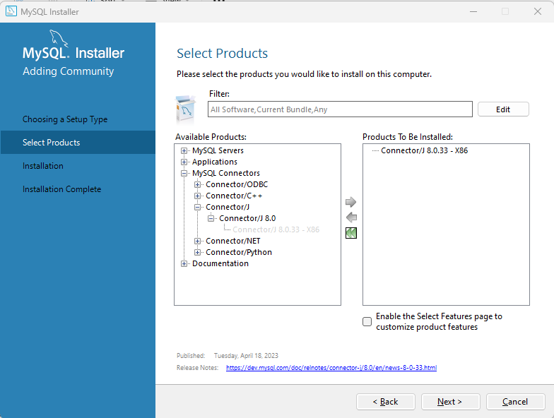

# Koneksi Java ke Database
Dalam kuliah ini, kita akan menggunakan database MySQL sebagai DBMS yang untuk program Java kita.

## Setup _J Connector_
1. [Download _MySQL_](https://dev.mysql.com/downloads/connector/j/)
2. Anda bisa melakukan instalasi MySQL secara lengkap. Tapi kalau Anda sebelumnya sudah pernah install XAMPP, Anda cuma memerlukan _J Connector_. Pilih install type _custom_, pilih _Connector/J..._. Pilih _Next_, _Next/Execute_.
   
   

3. Pada _project_ aktif Anda. Klik-kanan pada _Libraries - Add JAR/Folder..._. Cari file _mysql-connector-j-xxx.jar_ untuk menambahkannya ke project Anda.
   
   
   

## Test Koneksi
1. [Download & Restore database contoh](https://github.com/pujangga123/ruang-belajar-java/blob/main/src/MySqlTest.java) ke server _MySQL_ Anda.
2. Test koneksi menggunakan contoh program berikut:
    ```java
    import java.sql.*;
    
    public class MySqlTest {
        public static void main(String arg[]) {
            Connection connection = null;
            try {
                // below two lines are used for connectivity.
                Class.forName("com.mysql.cj.jdbc.Driver");
                connection = DriverManager.getConnection(
                    "jdbc:mysql://localhost:3306/tokobuku",
                    "root", "");
    
    
                Statement statement;
                statement = connection.createStatement();
                ResultSet resultSet;
                resultSet = statement.executeQuery(
                    "select * from barang");
                String kode;
                String nama;
                while (resultSet.next()) {
                    kode = resultSet.getString("kode");
                    nama = resultSet.getString("nama");
                    System.out.println("kode : " + kode
                                    + " nama : " + nama);
                }
                resultSet.close();
                statement.close();
                connection.close();
            }
            catch (Exception exception) {
                System.out.println(exception);
            }
        } // function ends
    } // class ends
    ```

---
**Referensi:**
- 
